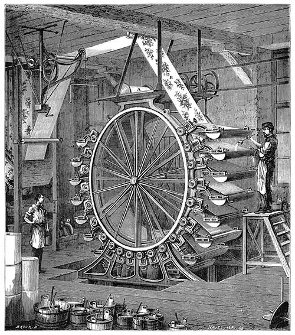

# StempelWerk

_Automatic code generation from Jinja templates_

<figure style="display: flex; flex-flow: column; max-width: 25em;">
  
  <figurecaption>
    <small>
      <em>
        Illustration by Narcisse Navellier (obtained from
        <a href="https://commons.wikimedia.org/wiki/File:Wallpaper-surface-printing-machine.jpg">
          Wikimedia Commons</a>)
      </em>
    </small>
  </figurecaption>
</figure>


## Introduction

StempelWerk has been created to prevent copy-and-paste errors and reduce tedious
manual work. This can lead to a tremendous saving in development time and cost.

- **Lean and easy to use**
  - Template system is easy to understand and lightweight
  - Templates can be introduced gradually
  - Any file can be switched back to manual editing by deleting its template
- **Mature and powerful**
  - All functionality is covered by unit tests
  - The template language Jinja2 is very mature, and has an excellent
    [Template Designer
    Documentation](https://jinja.palletsprojects.com/en/3.1.x/templates/)
  - A single template can create multiple files
  - Templates can undertake surprisingly complex tasks
  - Jinja2 (and thus StempelWerk) can be extended using Python
- **Permissive licensing**
  - StempelWerk: [BSD 3-Clause License](https://github.com/mzuther/StempelWerk/blob/main/LICENSE.md)
  - Jinja2: [BSD 3-Clause License](https://github.com/pallets/jinja/blob/main/LICENSE.txt)
  - Python: [PSF licencse](https://docs.python.org/3/license.html)
  - uv: [MIT License](https://github.com/astral-sh/uv/blob/main/LICENSE-MIT)


## Case study

I have used StempelWerk in a professional project to generate most code (SQL)
and part of the documentation (Markdown). StempelWerk even helped me during a
migration by creating code for two different types of database. I logged and
offset time gained against time spent: after nine months, I had saved 100+ hours
of working time!


## Installation

StempelWerk is currently developed in **Python 3.12**. Older versions of Python
used to work, and some probably still do.

### PyPI package

- For flexibility, use `pip`:

```bash
# bash
python3 -m pip install stempelwerk
```

- For simplicity, use `pipx`:

```bash
# bash
pipx install --upgrade stempelwerk
```

### Repository

1. Install [uv](https://docs.astral.sh/uv/getting-started/installation/)
2. Open the project directory
3. Setup the development environment

    - Linux shell:

    ```bash
    ./script/bootstrap
    ```

    - Windows PowerShell:

    ```ps1
    .\script\bootstrap.ps1
    ```

    - Anywhere:

    ```bash
    # edit `.python-version` to match your installed Python version,
    # or remove `--no-managed-python` to let uv install Python
    uv sync --no-managed-python
    ```


## Execution

- `pip` and `pipx`:

``` bash
stempelwerk [ARGUMENTS] SETTINGS_FILE_PATH
```

- `uv`:

``` bash
uv run stempelwerk [ARGUMENTS] SETTINGS_FILE_PATH
```

- Python package:

``` python
from stempelwerk.StempelWerk import StempelWerk

StempelWerk(...)
```

For help on the command line, simply call:

```bash
[uv run] stempelwerk --help
```

### Command line argument `--globals`

Path to a JSON file or a JSON-formatted string containing a dictionary of global
variables:

``` json
{
  "spam": "eggs"
}
```

StempelWerk forces explicit use of globals by grouping them under the
environment variable `globals`. In other words, you have to use `globals.spam`
or `globals['spam']` to access your global variable `spam`.

_Jinja supports several approaches of loading global variables. In case it
matters, StempelWerk loads globals when calling
`jinja2.Environment.get_template`._

_For a simple demonstration of globals, please render the provided example
templates with `--globals '{"NO_cast": true}'`._

### Command line argument `--only-modified`

By default, StempelWerk renders all template files it finds in the specified
template directory.

When you use the command line argument `--only-modified`, however, StempelWerk
tries to process only the template files that have changed since the last
successful run.

_This logic is not infallible: some file systems update modification times in a
weird manner, and changes to master templates (called "stencils" in StempelWerk)
are currently not handled. However, in such a case you can simply use
StempelWerk without the `--only-modified` argument._

_Do not use this command line argument in CI/CD pipelines!_

### Command line argument `--ultraquiet` and `--quiet`

Adding one of these command line arguments will display less information. Great
when working on slow consoles.

### Command line argument `--verbose`

Adding this command line argument will display additional information, such as
settings, loaded templates and added extensions. Very useful for debugging.


## Settings

StempelWerk reads its settings from a JSON file (see `settings_example.json` for
an example) . The path to this file is specified as command line argument, and
is relative to the current working directory.

_For cross-platform compatibility, I recommend using forward slashes in settings
for path separators: `/spam/eggs`. StempelWerk will handle path separator
conversions for you._

### `root_dir`

Path to root directory, relative to the current working directory. All other
paths are relative to this directory. This simplifies the setting up of paths.

### `template_dir`

Path to root of template directory, relative to `root_dir`. This directory is
scanned recursively, and all files matching the setting `included_file_names`
will be rendered using Jinja.

### `output_dir`

Path to root of output directory, relative to `root_dir`. Rendered files will be
saved in this directory.

### `stencil_dir_name`

**Default value: None**

Name of the directory containing stencils (master templates). The name must not
contain slashes or backslashes.

Files in directories matching this name will not be rendered. If this setting is
specified and no stencils are found, StempelWerk will exit with an error.

_There may be one or more directories with this name, and they must be located
somewhere under `template_dir`. This allows stencils to be loaded into Jinja,
and to be referenced from templates at runtime._

### `create_directories`

**Default value: False**

StempelWerk ensures that `template_dir` and `output_dir` exist. In case they are
not found, StempelWerk will exit with an error.

_Previously, these directories were created automatically, but that interfered
with debugging._

When this option is set to yes, all missing directories in the output directory
will be created automatically. This ensures that rendered files can always be
written.

_Depending on your use case, automatically created directories may be just
awkward or a full-blown security issue. This option is therefore disabled by
default, and I encourage you to leave it that way._

### `included_file_names`

List containing file specifications such as `*.sql.jinja`. Only files with a
[matching glob](https://docs.python.org/3/library/fnmatch.html) are considered
to be templates and will be passed to Jinja.

### `jinja_options`

**Default value: {}**

Dictionary containing [initialization
parameters](https://jinja.palletsprojects.com/api/#jinja2.Environment) for the
Jinja environment.

_Most default values work well for me, but I **always** enable
[`trim_blocks`](https://jinja.palletsprojects.com/en/3.1.x/templates/#whitespace-control):_

```json
  "jinja_options": {
    "trim_blocks": true
  },
```

### `jinja_extensions`

**Default value: []**

List containing Jinja extensions that will be loaded into the Jinja environment.

### `custom_modules`

**Default value: []**

List of Python modules, each containing a `CustomCode` class inheriting from
`StempelWerk.CustomCodeTemplate`. See directory `tests/tintin/custom` for
examples.

After creating the Jinja environment and loading Jinja extensions, each module
will be imported. An instance of `CustomCode` will be created and its method
`update_environment()` will be called. This method must return a Jinja
environment.

Use custom modules to add filters and tests to the environment, or perform any
other task Python is capable of.

_Warning: there are no security checks to prevent you from deleting all of your
files and doing other mischief, so please be careful!_

### `last_run_file`

**Default value: `.last_run`**

Path to the file for storing a time stamp of the last successful run. The path
is relative to `root_dir`.

_If your operating system handles temporary directories correctly (Windows does
not), you could store this file in one of them (e.g. `/tmp/`). With
`--only-modified`, all template files would be rendered once after starting the
system, and afterwards only when they are updated._

### `marker_new_file` and `marker_content`

**Default values: `### New file:` and `### Content:`**

Each time these strings are encountered in the rendered output of a template, a
new file is created. This allows you to create multiple files from a single
template.

The code relies on the following order: new file marker, optional whitespace,
path to the output file, optional whitespace, content marker, optional
whitespace, and contents of the output file:

```text
### New file: spam/eggs.py
### Content:
def spam():
    return 'eggs'
```

You can insert these markers by using a template filter provided by StempelWerk:

``` jinja
{{- ('directory/' ~ filename) | start_new_file -}}
```

or adding a macro to the template:

``` jinja

### New file: {{ filename }}
### Content:


{{- add_file_markers('directory/' ~ filename) -}}
```

_Good file separators strike a balance between performance (brevity) and
reliability (uniqueness). Please see the example files to see them in action._

### `newline`

**Default value: `None`**

Rendered files will be written using the operating system's standard newline
character. Change this setting to use another newline character, such as `\r\n`.

_StempelWerk overrides this setting for certain files, such as Windows Batch
files. If you want to change this behavior, please create an instance of
StempelWerk in Python and override its public member variable
`newline_exceptions`._


## Code of conduct

Please read the [code of
conduct](https://github.com/mzuther/StempelWerk/blob/main/CODE_OF_CONDUCT.md)
before asking for help, filing bug reports or contributing to this project.
Thanks!


## License

Copyright (c) 2020-2025 [Martin Zuther](https://www.mzuther.de/)

This program is free software and licensed under the terms of the [BSD 3-Clause
License](https://github.com/mzuther/StempelWerk/blob/main/LICENSE.md).

**Thank you for using free software!**
