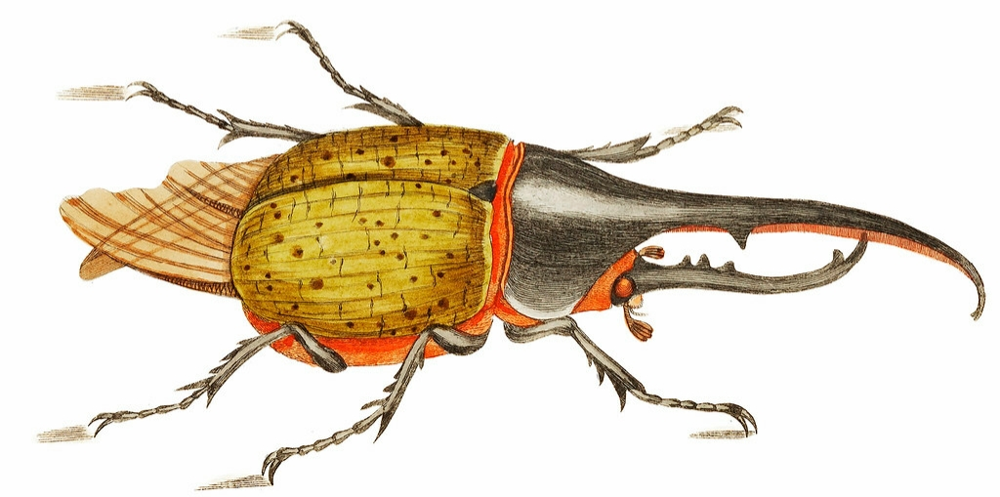

# DirWalk

_Crawl directories with style_

<figure style="display: flex; flex-flow: column; max-width: 25em;">
  
  <figurecaption>
    <small>
      <em>
        Illustration by George Shaw (obtained from
        <a href="https://en.wikipedia.org/wiki/File:%22_Hercules_beetle_illustration_from_The_Naturalist%27s_Miscellany_(1789-1813)_by_George_Shaw_(1751-1813)._%22.jpg">
          Wikimedia Commons</a>)
      </em>
    </small>
  </figurecaption>
</figure>

## Introduction

DirWalk provides a recursive, filtered and sorted list of the contents of a
given root directory. I find it easier to use than Python's `os.scandir`, but
your mileage may differ.

## Installation

_DirWalk was developed using Python v3.10+, so an older version might not
work._

Unless you want to test DirWalk, simply store it somewhere and import it. For
testing, you must install it into a virtual environment. The easiest way is to
run

```bash
# bash
./script/bootstrap
```

or

```ps1
# PowerShell
.\script\bootstrap.ps1
```

## Execution

See [example.py](./example.py) for example code and an explanation of parameters.

## Code of conduct

Please read the [code of conduct](./CODE_OF_CONDUCT.md) before asking for help,
filing bug reports or contributing to this project. Thanks!

## License

Copyright (c) 2020-2024 [Martin Zuther](https://www.mzuther.de/)

This program is free software and licensed under the terms of the [BSD 3-Clause
License](./LICENSE.md).

**Thank you for using free software!**
